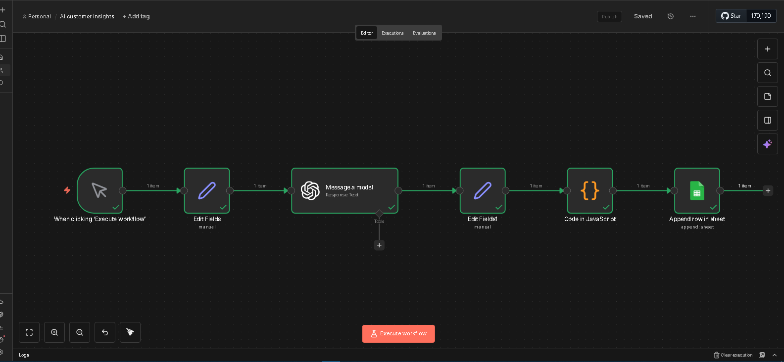

# AI Customer Insights System (n8n + AI)

## 🚀 Overview

This project is an AI-powered customer insights system that analyzes incoming messages and extracts meaningful business insights automatically.

---

## 💼 Problem it Solves

Businesses receive large volumes of customer messages but struggle to understand patterns, complaints, and opportunities hidden in the data.

This system turns raw conversations into actionable insights.

---

## ⚙️ How It Works

1. Customer messages are collected (Telegram, forms, or APIs)
2. Data is sent into n8n workflow
3. AI analyzes the content
4. Extracted insights include:

   * Customer sentiment
   * Common complaints
   * Frequently asked questions
   * Product/service feedback
5. Results are stored or sent as summaries

---

## 🧠 Key Features

* Automated message analysis
* Sentiment detection (Positive / Neutral / Negative)
* Insight extraction
* Summary generation using AI
* Integration with Google Sheets or dashboards

---

## 🛠️ Tools & Technologies

* n8n
* AI (OpenAI or similar)
* APIs / Webhooks
* Google Sheets (optional storage)

---

## 📊 Workflow Preview

---

## 🎯 Outcome

* Helps businesses understand customers better
* Identifies problems early
* Supports data-driven decisions
* Saves hours of manual analysis

---

## 🔮 Future Improvements

* Dashboard visualization
* Real-time analytics
* Integration with CRM tools
* Automated reporting

---

## 📩 Contact

Email: [josephnjuguna.automation@gmail.com](mailto:josephnjuguna.automation@gmail.com)
Phone: +254115361894

