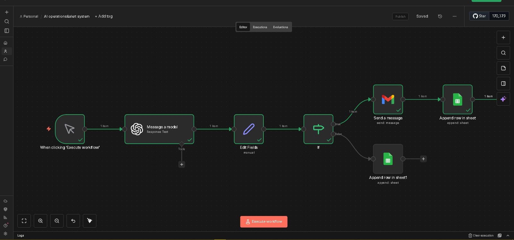

# 🚨 Monitor & Alert System  
### Real-Time Tracking & Instant Alerts

---

---

## 💼 What This System Does

This system monitors important events and sends **instant alerts** when something needs attention.

👉 Result: **Faster decisions and reduced losses**

---

## ⚠️ Problem It Solves

Businesses often:
- Miss critical events  
- React too late  
- Lose money due to delays  

---

## ⚙️ How It Works

1. System monitors defined triggers (data, events, systems)
2. Detects important changes
3. Sends instant alerts (Telegram / Email)
4. Business reacts immediately

---

## 🔥 Key Benefits

✔ Real-time monitoring  
✔ Instant alerts  
✔ Faster response  
✔ Prevent losses  
✔ Improve operations  

---

## 🧠 Business Impact

- Stay in control of operations  
- Respond instantly to issues  
- Reduce downtime and risks  

---

## 🛠 Tech Stack

- n8n
- APIs / Webhooks
- Telegram / Email alerts

---

## 📥 Download Workflow

👉 [Download JSON](your-json-link-here)

---

## 📞 Want This System?

👉 https://wa.me/254115361894

---
